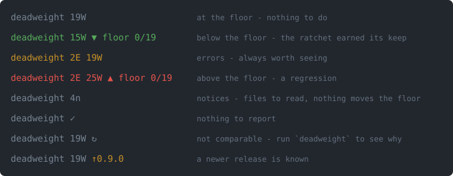

# Deadweight

**Audit the Claude Code configuration of a project or a plugin** — `CLAUDE.md`, skills, sub-agents,
rules, hooks, settings, and the context all of it costs on every turn. One skill, one Python script,
no dependencies, no network.

Deadweight is configuration you carry that does nothing: instructions paid for on every turn that
nothing reads, rules whose glob matches no file, links to files that are gone, two skills stealing
each other's requests, a skill that loads nowhere because it sits one folder off. The audit finds
them and says why each one matters.



## Install

```bash
claude plugin marketplace add e-xode/deadweight --scope project
claude plugin install deadweight@deadweight --scope project
```

`--scope project` on **both** writes the marketplace and the plugin into the project's
`.claude/settings.json`, so anyone who clones the repository gets them too — the plugin alone would
name a marketplace their machine does not know. Leave both out to install it for yourself only, in
every project.

**Then open a new session in that project.** Plugins are read when a session starts: on the first
one after installing, the skill is loaded and the audit runs silently in the background.

**Check that it is active:** in that new session, ask Claude to run `deadweight`. It prints this
project's findings. (`claude plugin list` shows the installs of every project on the machine, not
only this one.)

**Requirements: `python3` 3.9+**, standard library only. No `jq`, no Node, no pip install.

## Use

| You want | Do |
| --- | --- |
| Claude to review the configuration | ask for it — the `deadweight:config-auditor` skill loads when the task is about configuration |
| the findings for this project | ask Claude to run `deadweight`, or run it yourself (see below) |
| errors only | `deadweight --errors` |
| to measure again after editing | `deadweight --fresh` — measures, updates the status line, shows the result |
| the raw report | `deadweight --json` |
| the counts in your status line | `deadweight --setup-statusline`, then a new session |
| to stop the configuration from getting worse | `--set-floor` once, `--check-floor` in CI — see [The ratchet](#the-ratchet) |
| to turn it off in one project | `claude plugin disable deadweight --scope project` |

`deadweight` is on the Bash tool's `PATH` while the plugin is enabled, so Claude can run it. To run
it from your own shell, define it once:

```bash
# ~/.bashrc or ~/.zshrc
deadweight() {
  local p
  p=$(claude plugin list --json | python3 -c 'import json,sys
rows=[r for r in json.load(sys.stdin) if r["id"].startswith("deadweight@")]
print(sorted(rows, key=lambda r: r["version"])[-1]["installPath"])')
  python3 "$p/bin/deadweight" "$@"
}
```

### Reading the status line

`deadweight --setup-statusline` writes `.claude/statusline.py` and sets `statusLine` in the
project's `.claude/settings.json`. It refuses to overwrite a status line you already have, and tells
you where the segment is so you can splice it into yours. A plugin cannot ship a `statusLine`
itself, so this one command is the shortest honest path.

| Shown | Means | Do |
| --- | --- | --- |
| `deadweight 19W` dim | at the floor — the accepted state | nothing |
| `deadweight 15W ▼ floor 0/19` green | below the floor | re-set the floor to lock the gain |
| `deadweight 2E 19W` yellow | errors, even under the floor | `deadweight --errors` |
| `deadweight 2E 25W ▲ floor 0/19` red | above the floor — a regression | `deadweight` |
| `deadweight ✓` | nothing to report | nothing |
| `↻` | the number is not comparable: the configuration changed since it was measured, or the floor was set by another auditor | `deadweight` says which, and what clears it |
| `↑0.9.0` | a newer release is known | `claude plugin update deadweight@deadweight`, then a new session |

**Colour encodes what needs an action, not the size of the count.** A repository at its floor has
nothing to do, so it is dim — a signal that is always on teaches the eye to skip it. Zero counts
are not shown, and the version appears only when it differs from the newest one known: on its own
a version names a state, and a difference names an action.

`↻` carries no remedy on purpose. The line compares two auditor fingerprints and cannot tell which
one is older; when the floor is the older side, measuring again changes nothing. `deadweight`
knows, and says either `deadweight --fresh` or `--set-floor`.

Everything is read from files on disk — the cached measurement, Claude Code's own record of
installed plugins and the local copy of the marketplace. The status line never measures and never
touches the network: it re-runs on every message, and a script still running when the next update
arrives is cancelled.

### Running the audit directly

```bash
PLUGIN=$(deadweight --where)                                          # the plugin's root
python3 "$PLUGIN/skills/config-auditor/scripts/audit.py" --root .          # text
python3 "$PLUGIN/skills/config-auditor/scripts/audit.py" --root . --json   # JSON
```

## What it checks

Each report ends with the number of check groups it ran. Check ids are stable (see
[Check ids are a public API](#check-ids-are-a-public-api)).

| Family | What goes wrong | Examples of checks |
| --- | --- | --- |
| **What it costs** | text injected on every turn that nothing uses | `CLAUDE.md` size, always-loaded budget, skill listing budget, description length |
| **What it points at** | references to things that do not exist | dead links, dead path anchors in skills, rule globs matching no file, hooks calling missing scripts |
| **Whether it loads** | configuration Claude Code never reads | skills outside a loaded location (`40`), withheld skills nothing points at (`15`), `name` not matching its folder |
| **Whether skills compete** | two descriptions close enough to steal each other's triggers | description overlap, missing anti-triggers |
| **Whether it can be shown wrong** | claims nothing can refute | skills naming no checkable path, eval suites that cannot fail or cannot run |
| **What executes** | hooks that never fire, or fire with the wrong budget | unknown events, `if` on a non-tool event, bare `mcp__<server>` matchers, per-event timeouts |
| **What is silently ignored** | settings and permissions that look active and do nothing | keys outside their scope, allow rules naming no tool, a rule both allowed and denied |
| **What leaks** | credentials in files every clone receives | literal tokens in `.mcp.json`, credential variables read as empty, committed MCP approvals, routing `env` |
| **Plugin packaging** | a plugin that ships what does not load | components inside `.claude-plugin/`, paths without `./`, fields replacing a default directory, version drift |

It recognises the container before judging it: a **project** (`.claude/`), a **plugin** (manifest,
or `skills/` at the root without one), a **marketplace**, a **library** of skills kept at the root,
or **none** — a repository with no Claude Code configuration, which gets no finding rather than
"CLAUDE.md not found".

## Per-project exceptions

One file, in **your** project, never in the plugin:

```jsonc
// .claude/audit.local.json
{
  "exemptions": [
    {
      "check": "11-english-only",
      "path": "translate/references/glossary.md",
      "reason": "a glossary of source-language terms; translating it removes its subject",
      "date": "2026-09-22"
    },
    {
      "check": "22-rule-glob-match",
      "path": ".claude/rules/admin-api-guard.md",
      "reason": "guards a route that ships next quarter; the rule lands before the code",
      "date": "2026-09-22",
      "severity": "INFO"          // downgrade instead of erase - the count stays visible
    }
  ],
  "thresholds": {
    "CLAUDE_MD_MAX_BYTES": { "value": 14000, "reason": "bilingual repo", "date": "2026-09-22" }
  }
}
```

**House conventions.** Some checks encode this plugin's own conventions rather than Anthropic's
documentation — each is listed, with its source and its evidence, in
[`evals/CONVENTIONS.md`](evals/CONVENTIONS.md). By default they report as INFO, naming what
Anthropic documents instead. `"profile": "house"` in the overlay turns them into warnings.

`reason` and `date` are required: an exemption without a reason is a decision nobody can review,
and one without a date is a decision nobody can age out. `severity` is optional and accepts only
`WARN` or `INFO` — the finding stays in the report, marked `[excused by overlay]`, at a level that
does not fail CI. Prefer it to erasing: an erased finding is one `--check-floor` can no longer
watch grow.

An exemption may not silence the checks that audit the overlay, nor the ratchet itself
(`31-*`, `34-audit-sha`, `00-layout`). A release valve able to disconnect its own pressure gauge
is not a valve.

### Thresholds: which ones a project may move

| Family | Examples | Overridable |
| --- | --- | --- |
| **Mechanism** — imposed by the harness | the 1,024-char spec cap on `description`, the 1,536 listing cutoff, the context window | **No.** Moving the number changes what the audit says, not what the harness does |
| **Doctrine** — uniform by choice | `CLAUDE_MD_MAX_BYTES`, the always-loaded budget, the overlap threshold, eval coverage | **Yes**, with a reason and a date |
| **Derived** — computed from the project's own settings | the listing ceiling, from `skillListingBudgetFraction` | Already the project's |

Every applied override prints itself on every run, so a doctrine is never rewritten quietly.

---

# Reference

Everything below explains why the plugin behaves as it does. None of it is needed to use it.

## The ratchet

```bash
python3 skills/config-auditor/scripts/audit.py --root . --set-floor    # freeze today's counts
python3 skills/config-auditor/scripts/audit.py --root . --check-floor  # fail if they rose
```

A measurement with no floor is one people learn to ignore: the numbers move, nobody owns the
direction, and a year later every step looked reasonable. The floor is the number the configuration
may not rise above. Commit `.claude/audit/floor.json` — a ratchet nobody else can see is a private
opinion — and let its git history be the run history, each move with a commit message saying why.

The floor records the **fingerprint of `audit.py`**, and `--check-floor` refuses to compare across
two of them. A count taken with a different auditor is not a better or worse state — it is a
different measurement, and comparing the two silently is how a change of instrument gets read as
progress. The refusal is a warning, not a failure, so it does not break CI; it prints both counts
side by side and asks you to re-set deliberately.

This repository runs its own ratchet in CI (`.github/workflows/audit.yml`): a repository that ships
an auditor and does not run it on itself has the exact defect it exists to catch.

## Versions and your floor

| Release | `audit.py` | Your floor |
| --- | --- | --- |
| **patch** (`0.9.x`) | unchanged | still valid |
| **minor** (`0.x.0`) | may have changed | re-set it after reading both counts |

While the plugin is `0.x`, a minor release is the breaking one. Even a fix that removes a false
positive changes the counts, so it ships as a minor. The CHANGELOG opens with a warning whenever
the auditor changed.

## Two channels, two prices

The `SessionStart` hook runs the audit and caches the result in
`${XDG_CACHE_HOME:-~/.cache}/claude-audit/`, **outside** the repository. It prints **nothing**.

That silence rests on a measurement: a plugin hook's stdout **enters the model's context** — a
probe plugin printing marker lines had them read back verbatim by a fresh session. Whatever a hook
prints is paid for in every session of every project that installs the plugin.

| Channel | Who reads it | What it costs |
| --- | --- | --- |
| Hook stdout | the model | tokens, every session, every project |
| Status line | you | nothing — it "runs locally and does not consume API tokens" |

Numbers a human glances at belong in the status line. The hook runs on `startup` and `resume` only;
opting out is per project and covers the whole plugin, not the hook alone.

## The doctrine behind the checks

The skill carries reference files — skill anatomy, sub-agent anatomy, rules, `CLAUDE.md`, runtime
mechanisms, anti-patterns, the audit checklist, and a curated list of official sources. Most of
these rules are not obvious and several are documented nowhere:

- a skill `description` is capped at **1,024 characters by the Agent Skills spec**; the **1,536**
  figure is a different thing — the listing cutoff for `description` + `when_to_use` combined;
- past roughly **20 KB**, a `SKILL.md` loses its tail after the first auto-compaction, silently;
- `paths:` on a skill **withholds** it — it does not scope it;
- Claude Code finds skills **by location, not by content**: `<name>/SKILL.md` at a repository root
  loads nowhere, `skills/<name>/SKILL.md` loads as a plugin even without a manifest.

Every factual claim carries its source and the date it was verified; where a measurement was taken
rather than read, the protocol to reproduce it is given.

## What belongs to the project, not to this plugin

A plugin is the same bytes in every project that installs it, so it holds no project's state:

| What | Where | Written by |
| --- | --- | --- |
| Exemptions and threshold overrides, each with reason and date | `.claude/audit.local.json` | you |
| Decisions that attach to no single check | `.claude/audit/decisions.md` | you |
| What the audit reported over time | the git history of `.claude/audit/floor.json` | you, each time you re-set it |

Templates are in `skills/config-auditor/templates/`. All three are optional: absent means "this
project has recorded nothing", a valid state.

## Check ids are a public API

A consuming project names check ids in its `.claude/audit.local.json`, so ids are **never renamed**.
An id that must change goes into `CHECK_ID_ALIASES` in `audit.py`, old → new; the old id keeps
working for good, and the audit says once that a newer name exists.

## Where the examples come from

The examples describe one fictional online shop whose skills are named `shop-*`, `ui-*`, `api-*`
and `data-*` — deliberately not `foo`/`bar`, because a model learns from the *shape* of an example.
The measurements are real, taken on a private fleet and on public repositories, each dated. Only the
names are not. The status line image is generated from the real template on that fictional project
by `docs/render_statusline.py`.

## Status

Pre-1.0. The doctrine comes from one private fleet, and has since been measured against two samples
of public repositories the auditor had never seen — the second drawn after the first, so it could
not overlap. Each sample found defects in the auditor itself, recorded in the CHANGELOG. Issues and
counter-examples are the point.

## License

MIT.
